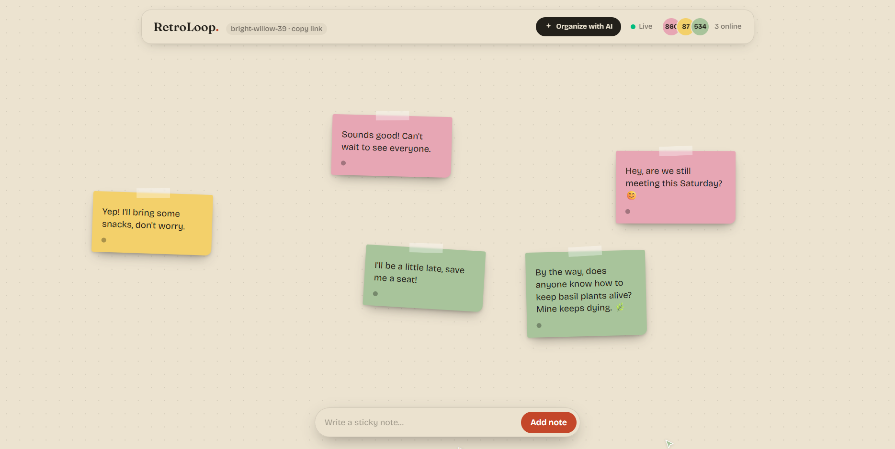
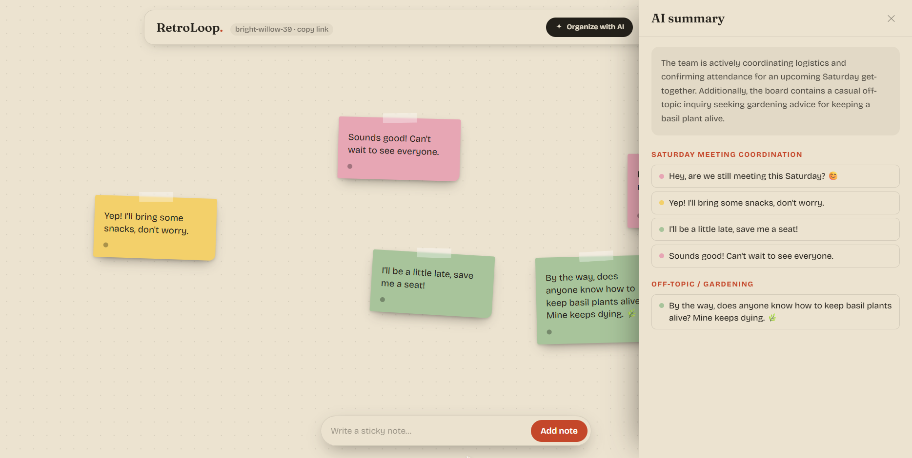
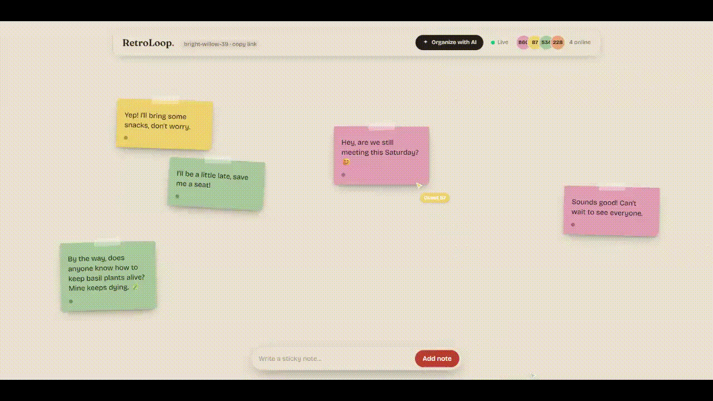
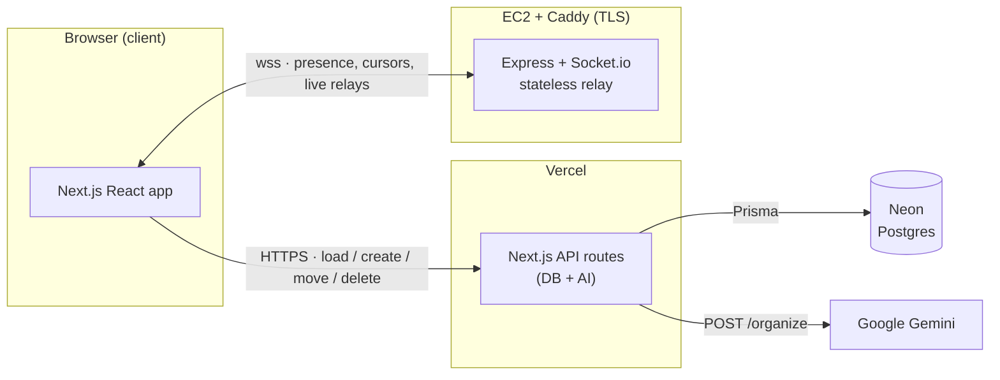

# RetroLoop

**Real-time collaborative retro & brainstorm board.** Join a shared room by link — no account needed — and drop sticky notes together while everyone's notes and cursors update live. When the board gets messy, one click of **Organize with AI** clusters the notes into labeled themes and summarizes the key takeaways.

🔗 **Live demo:** <https://retroloop-seven.vercel.app>
📁 **Repo:** github.com/dotrainier/retroloop

> Built as a flagship portfolio project. The focus is a genuinely working multiplayer experience — open two browser windows and edits, cursors, and presence sync instantly — rather than feature count.



---

## Features

- **Rooms / boards** — create a board and get a shareable code (e.g. `bold-falcon-72`); anyone with the link joins instantly, no login.
- **Real-time collaboration** — multiple users on one board at once; notes and cursors update live for everyone.
- **Presence** — see who's currently online as colored avatars with a live count.
- **Live cursors** — every participant's cursor is shown with a name label, smoothed as it moves.
- **Sticky notes** — add, delete, and drag notes; each has text, an author, and a color; all changes sync in real time.
- **AI Organize** — on-demand, rate-limited clustering of notes into labeled groups (e.g. "What went well", "Action items") plus a short summary of the board's takeaways, powered by Google Gemini.
- **Polish** — warm, tactile "paper workshop" design, optimistic drag with smoothed remote updates, and graceful empty/loading/error states.





---

## Architecture

RetroLoop is intentionally split across **three services**, each doing one thing:



### Why the split?

The core requirement — smooth real-time sync — drives the whole design.

**Socket.io needs a persistent, long-lived server**, which Vercel's serverless functions cannot provide (they spin up per request and don't hold open connections). So the real-time layer runs as a **separate Express + Socket.io process** on a persistent Node host (EC2), while the rest of the app — UI, database access, and the AI feature — stays on **Vercel**.

This gives a clean separation of concerns:

| Service               | Responsibility                                         | Notes                                               |
| --------------------- | ------------------------------------------------------ | --------------------------------------------------- |
| **Next.js on Vercel** | UI, database API routes, AI Organize route             | Serverless; the app's front door                    |
| **Socket.io on EC2**  | Live connections, presence, cursors, note event relays | A single persistent Node process, kept alive by pm2 |
| **Neon (Postgres)**   | Persistence — boards & notes                           | **The source of truth**                             |
| **Google Gemini**     | Note clustering + summary                              | Called on demand, rate-limited                      |

### How a note change flows

The most important idea: **the database is the source of truth, and the socket server is a stateless relay.** A note mutation is two cooperating steps:

1. The client writes the change to Postgres through a Next.js API route (durable).
2. The client emits an event to the Socket.io server, which **relays** it to everyone else in the room so it appears live (ephemeral).

On join, a client loads existing notes from the database (via an API route), **not** from the socket server. This means the socket server holds no note state at all — restart it, and no data is lost. Presence (who's online) is the only in-memory state it keeps, which is correct because presence is inherently ephemeral.

---

## Tech stack

**Frontend (Vercel)**

- Next.js (App Router) + TypeScript
- Tailwind CSS
- `socket.io-client`
- Custom fonts (Fraunces + Bricolage Grotesque) to avoid a generic AI-generated look

**Real-time server (EC2)**

- Node.js + Express + TypeScript
- Socket.io
- Caddy (reverse proxy + automatic HTTPS via Let's Encrypt)
- pm2 (process manager — restarts on crash/reboot)

**Data + AI**

- PostgreSQL on Neon
- Prisma ORM
- Google Gemini (`gemini-2.5-flash`) via `@google/genai`

---

## Key engineering decisions

These are the trade-offs I made deliberately and can walk through:

- **Persistent server vs. serverless.** Real-time WebSocket connections need a long-lived process, so the Socket.io server is deployed separately from the serverless Next.js app. This is the central architectural decision.

- **Socket server as a pure relay.** All persistence lives in Next.js API routes; the socket server never touches the database. This keeps it small, easy to reason about, and stateless — it can restart without data loss.

- **Optimistic updates + throttling for drag.** While dragging a note, the local UI updates instantly (optimistic) and position events are throttled to ~25/sec over the socket; only the _final_ resting position is persisted to the database. Remote clients apply a short CSS transition so a note someone else moves glides smoothly between throttled updates instead of jumping.

- **Last-write-wins concurrency.** If two people move the same note at once, the last update the server sees wins. This is the simplest defensible strategy for a shared whiteboard and avoids the complexity of operational transforms / CRDTs, which would be overkill here.

- **Secure WebSockets (`wss://`) with no domain.** An HTTPS frontend cannot open an insecure `ws://` connection (mixed-content blocking), and browsers won't trust a TLS certificate issued for a bare IP. The socket server therefore uses a free DuckDNS subdomain plus Caddy, which auto-provisions a Let's Encrypt certificate — giving a trusted `wss://` endpoint at no cost.

- **`NEXT_PUBLIC_` build-time inlining.** The socket server URL is exposed via `NEXT_PUBLIC_SOCKET_URL`, which Next.js inlines at **build time**. Changing it requires a redeploy — a subtle gotcha handled by setting it before the production build.

- **Open, unauthenticated editing.** Any participant can move or delete any note. This matches how real retro tools behave (the board is shared and gets tidied collaboratively), and since identities are anonymous guests with no auth, enforcing per-author ownership wouldn't be meaningful anyway.

---

## Project structure

```
retroloop/
├─ app/
│  ├─ page.tsx                    # Landing: create or join a board
│  ├─ board/[roomId]/page.tsx     # The board (thin — composes hook + components)
│  └─ api/
│     ├─ boards/[roomId]/route.ts            # GET: load-or-create a board
│     ├─ boards/[roomId]/notes/route.ts      # POST: create a note
│     ├─ boards/[roomId]/organize/route.ts   # POST: AI Organize (rate-limited)
│     └─ notes/[noteId]/route.ts             # PATCH move / DELETE
├─ components/board/              # Toolbar, BoardCanvas, NoteCard, Cursor, NoteComposer, OrganizePanel
├─ hooks/
│  ├─ useBoard.ts                 # All socket + state logic (presence, cursors, notes)
│  └─ useOrganize.ts              # AI Organize call state
├─ lib/
│  ├─ board-types.ts              # Shared types (client/server contract)
│  ├─ identity.ts                 # Guest name/color, note tilt, scatter position
│  ├─ room-code.ts                # Shareable board codes
│  ├─ gemini.ts                   # Gemini client + organize prompt
│  └─ prisma.ts                   # Prisma client singleton
├─ prisma/schema.prisma           # Board + Note models
└─ socket-server/                 # SEPARATE Node app, deployed to EC2
   └─ src/index.ts                # Express + Socket.io relay
```

---

## Running locally

### Prerequisites

- Node.js 20+
- A Neon (or any Postgres) database
- A Google Gemini API key ([aistudio.google.com](https://aistudio.google.com))

### 1. Frontend (Next.js)

```bash
git clone https://github.com/YOUR_USERNAME/retroloop.git
cd retroloop
npm install
npx prisma migrate dev   # apply the schema to your database
npm run dev              # http://localhost:3000
```

### 2. Real-time server (in a second terminal)

```bash
cd socket-server
npm install
npm run dev              # listening on port 4000
```

Then open `http://localhost:3000` in a normal window and an incognito window to see live sync between two "users."

### Environment variables

**Frontend** — `.env` (read by Prisma **and** Next.js):

| Variable         | Description                                                   |
| ---------------- | ------------------------------------------------------------- |
| `DATABASE_URL`   | Neon **pooled** connection string (has `-pooler` in the host) |
| `DIRECT_URL`     | Neon **direct** connection string (for Prisma migrations)     |
| `GEMINI_API_KEY` | Google Gemini API key (server-side only)                      |

**Frontend** — `.env.local`:

| Variable                 | Description                                                                              |
| ------------------------ | ---------------------------------------------------------------------------------------- |
| `NEXT_PUBLIC_SOCKET_URL` | Socket server URL — `http://localhost:4000` locally, `wss://<your-domain>` in production |

**Socket server** (set via pm2 in production; defaults are fine locally):

| Variable        | Description                                                                               |
| --------------- | ----------------------------------------------------------------------------------------- |
| `CLIENT_ORIGIN` | Allowed CORS origin — your Vercel URL in production (defaults to `http://localhost:3000`) |
| `PORT`          | Defaults to `4000`                                                                        |

---

## Deployment

- **Frontend → Vercel.** Connect the repo; set the environment variables above (set `NEXT_PUBLIC_SOCKET_URL` to the `wss://` URL **before** building).
- **Database → Neon.** Free-tier Postgres; run `prisma migrate deploy`.
- **Socket server → EC2.** Ubuntu instance running the Node process under **pm2**, fronted by **Caddy** for automatic HTTPS. A free **DuckDNS** subdomain points at the instance so Caddy can issue a Let's Encrypt certificate, exposing a secure `wss://` endpoint. Only ports 22/80/443 are open; the Node process on `:4000` is reachable only via Caddy's local proxy.

---

## Known limitations & possible next steps

- **Presence is single-instance.** Online-user state lives in the socket server's memory, so it assumes one server instance. Scaling horizontally would require a shared store (e.g. Redis) — a deliberate simplification for a single free-tier instance.
- **Anonymous identities** reset each session (no accounts by design). A "set your name on join" screen with `localStorage` persistence is a natural enhancement.
- **AI rate limiting is in-memory**, so it resets on cold start and isn't shared across instances; a production version would use a durable store like Upstash Redis.
- **AI results are shown to the requester only.** Broadcasting the summary to the whole room over the socket would make it a shared moment.

---

## License

MIT
